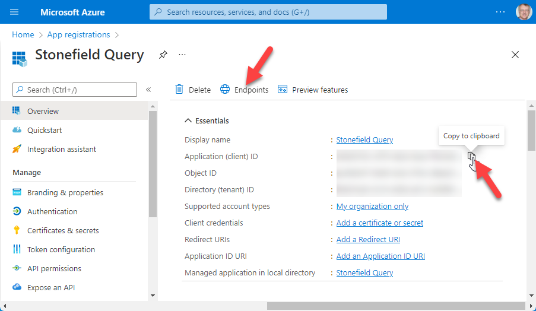
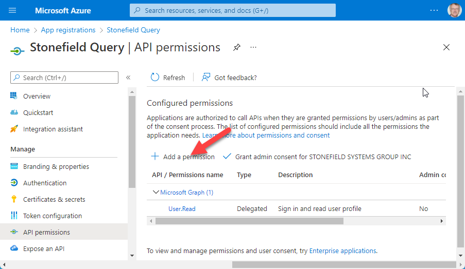
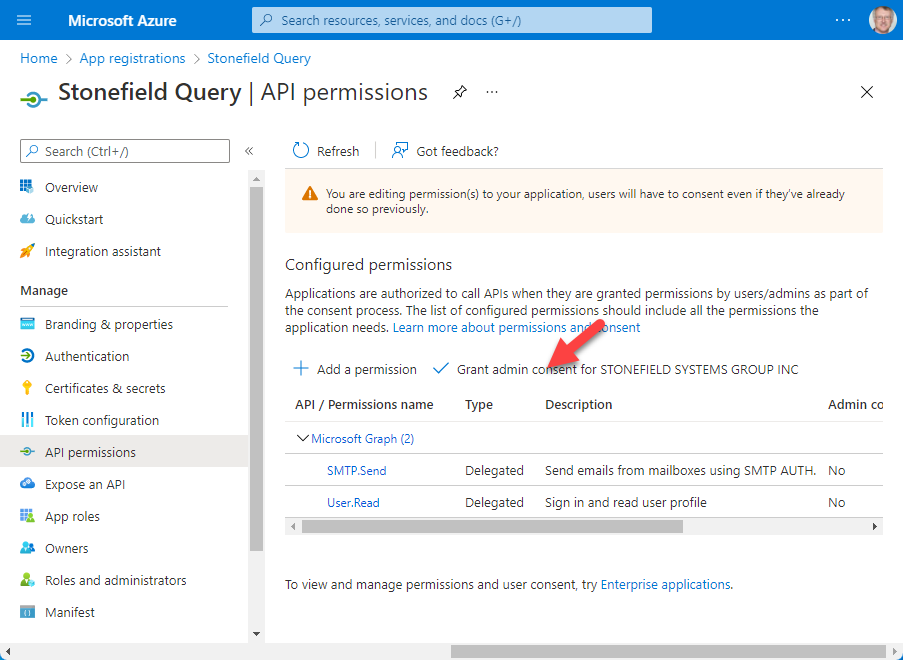

# Setting up Office 365 for Modern Authentication

Basic Authentication is deprecated in Microsoft Exchange, and by extension Office 365; see https://docs.microsoft.com/en-us/exchange/clients-and-mobile-in-exchange-online/deprecation-of-basic-authentication-exchange-online for the reasons and timeframe. That means you must use Modern Authentication (also known as OAuth2) instead.

Before you can use SFMail with Office 365 using Modern Authentication, you have to configure your Office 365 account to allow that. There are quite a few steps, but they're simple and listed in detail here.

> Your users have to follow these same steps as well to configure their accounts.

* Navigate your browser to https://portal.azure.com and login using your Office 365 user name and password.

* Click the App Registrations button in the Azure Services section.

    

* Click the New Registration button at the top left of the App Registrations page.

    

* Fill in the name of the application. The name isn't important; it's just used to identify it in the list of registered applications, so use a name that's meaningful.

* For Supported Account Types, choose the first option (the default): "Accounts in this organizational directory only"

* Click the Register button.

    

* In the page that appears, hover your mouse over the right side of the Application (client) ID setting (blurred out in this image for obvious reasons) to make the Copy to Clipboard button appear, click that button, then paste the clipboard somewhere to save it. This value goes into the cOAuthClientID property of the SFMail object.

    

* Click the Endpoints button. Click the Copy to Clipboard button beside the OAuth 2.0 Token Endpoint (v2) (blurred out in this image) displayed in the Endpoints page and paste the clipboard somewhere to save it. This value goes in the cOAuthURL property of the SFMail object.

    

* Click the X in the upper right corner to close the Endpoint page.

* Click API Permissions in the panel at the left.

    

* In the API Permissions page, click Add a Permission

    

* In the Request API Permissions page, click Microsoft Graph.

    

* In the Request API Permissions, Microsoft Graph page, click Delegated Permissions, then type "SMTP" in the Select Permission box to display the SMTP settings. Click the ">" beside SMTP to expand it, click in the SMTP.Send checkbox to turn it on, and click the Add Permissions button at the bottom.

    

* Click the Grant Admin Consent button and choose Yes in the confirmation dialog.

    

* Click Overview in the panel at the left, and click the Add a Certificate or Secret link beside Client Credentials.

    

* In the Certificates & Secrets page, click New Client Secret.

    

* In the Add a Client Secret page, enter a description (it isn't important, so perhaps enter the name of the application like you did earlier) and choose the desired Expires value. If you choose Custom, you can enter Start and End dates, but the end date can't be more than two years after the start date. Click Add.

    

* Click the Copy to Clipboard button beside the Value setting (blurred out in this image) and paste the clipboard somewhere to save it. This value goes in the cOAuthClientSecret property of the SFMail object.

    

> Be sure to do this now because you can't retrieve it later.

That's it: your Office 365 account is now configured to use Modern Authentication. Use the three values you saved in the properties of the SFMail object:

* OAuth 2.0 Token Endpoint (v2) URL: goes into the cOAuthURL property
* Client ID: goes into the cOAuthClientID property
* Client Secret: goes into the cOAuthClientSecret property

In addition to these, you also need to set the cOAuthScope property. The value for that is the same for everyone: https://outlook.office.com/SMTP.Send.