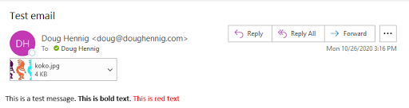

# SFMail

[](ChangeLog.md)

There are many libraries you can use to send emails from VFP applications. I created my own several years ago: a C# wrapper class using the .NET <a href="https://docs.microsoft.com/en-us/dotnet/api/system.net.mail.smtpclient?view=netcore-3.1" target="_blank">SMTPClient class</a>, which I call using Rick Strahl's <a href="https://github.com/RickStrahl/wwDotnetBridge" target="_blank">wwDotNetBridge</a>. However, as discussed <a href="https://www.infoq.com/news/2017/04/MailKit-MimeKit-Official/" target="_blank">here</a>, Microsoft no longer recommends using this class because it doesn't support modern protocols. As suggested in the article, I've rewritten my wrapper class to use the open source <a href="https://github.com/jstedfast/MailKit" target="_blank">MailKit</a> project.

Here's some code that shows how to use this wrapper class with Office365:

```FoxPro
local loMail, ;
   llReturn
loMail = newobject('SFMail', 'SFMail.prg')
with loMail
   .cServer      = 'smtp.office365.com'
   .cUser        = 'MyUserName'
   .cPassword    = 'MyPassword'
   .nSMTPPort    = 587
   .cSenderEmail = .cUser
   .cSenderName  = 'My Name'
   .cRecipients  = 'someone@somewhere.com'
   .cSubject     = 'Test email'
   .cBody        = 'This is a test message. ' + ;
      '<strong>This is bold text</strong>. ' + ;
      '<font color="red">This is red text</font>'
   .cAttachments = 'koko.jpg'
   llReturn      = .SendMail()
   if llReturn
      messagebox('Message sent')
   else
      messagebox('Message not sent: ' + .cErrorMessage)
   endif llReturn
endwith
```

Here's what the received email looks like. Notice the attached image and the formatted text.



The class supports the following:

* Text or HTML body

* Attachments

* Normal, CC, and BCC recipients

* SMTP or MAPI

* Adjustable timeout

* Adjustable security settings

* Diagnostic logging

## Modern Authentication

Basic Authentication is simply providing a user name and password to connect to a mail server. More and more mail services are moving away from Basic Authentication and implementing Modern Authentication, also known as OAuth2. Modern Authentication uses a two-step process to connect to a mail server: first obtaining a token (a string) from a web server, then using that token to connect to the mail server.

SFMail supports Modern Authentication through the cOAuth* properties. Simply set them to the appropriate values and SFMail takes care of both steps for you.

<a href="ModernAuth/Office365.md" target="_blank">Office365.md</a> has instructions for configuring Office 365 and getting the values you need for Modern Authentication.

## Properties

* cAttachments: A comma-comma-separated list of attachments for the email.

* cBCCRecipients: A comma- or semicolon-separated list of BCC recipients for the email.

* cBody: The email body. Use HTML tags to format the body as HTML.

* cCCRecipients: A comma- or semicolon-separated list of CC recipients for the email.

* cErrorMessage: The text of any error.

* cLogFile: The name and path of a log file (SMTP only). The log file contains the dialog between MailKit and the mail server so you can debug any problems. Set it to an empty string (the default) to not do logging.

* cPassword: The password for the mail server (SMTP only).

* cRecipients: A comma- or semicolon-separated list of recipients for the email.

* cReplyTo: The Reply To address for the email (SMTP only).

* cSenderEmail: The email address of the sender (SMTP only).

* cSenderName: The name of the sender (SMTP only).

* cServer: The mail server address (SMTP only).

* cSubject: The email subject.

* cUser: The user name for the mail server (SMTP only).

* lUseHTML: .T. to send the email as HTML or .F. to use plain text. It defaults to .F. but is automatically set to .T. if you set cBody to a value containing both "<" and ">". You can set it back to .F. if desired before calling Send.

* lUseMAPI: .T. to use MAPI or .F. (the default) to use SMTP. SFMail uses Craig Boyd's <a href="https://www.sweetpotatosoftware.com/blog/index.php/2007/06/09/updated-visual-foxpro-extended-mapi-fll/" target="_blank">VFPExMAPI.fll</a> if this property is .T.

* nSecurityOptions: The SecureSocketOptions value to use; see the <a href="http://www.mimekit.net/docs/html/T_MailKit_Security_SecureSocketOptions.htm" target="_blank">MailKit documentation</a> for the values) (SMTP only). The default is 1 (Auto), which I find works best for most servers.

* nSMTPPort: The SMTP port to use (SMTP only). The default is 25.

* nTimeout: The email timeout in seconds (SMTP only). The default is 30.

* cOAuthURL: The URL to obtain an OAuth 2.0 token.

* cOAuthClientID: The OAuth2 Client ID.

* cOAuthClientSecret: The OAuth2 Client Secret.

* cOAuthScope: The OAuth2 scope. For Microsoft 365, use https://outlook.office.com/SMTP.Send.

## Using SFMail

To use SFMail, instantiate the SFMail class, set the appropriate properties, and call the SendMail method. See the sample program at the top of this document.

To deploy SFMail with your application, add SFMail.prg and wwDotNetBridge.prg to your project and include the following files with the files distributed with your application:

* ClrHost.dll

* MailKitLite.dll

* MimeKitLite.dll

* SMTPLibrary2.dll

* System.Buffers.dll

* System.Formats.Asn1.dll

* System.Memory.dll

* System.Numerics.Vectors.dll

* System.Runtime.CompilerServices.Unsafe.dll

* System.Threading.Tasks.Extensions.dll

* System.ValueTuple.dll

* VFPExMAPI.fll (only needed if you use MAPI)

* wwDotNetBridge.dll

> Note: if your app runs from a network folder, you will likely need to distribute a config file that tells .NET to allow remote execution. Rename myapp.exe.config included in this repository to the name of your EXE; for example, for an EXE named Customers.exe, rename myapp.exe.config to Customers.exe.config and distribute it with the application.

## .NET Wrapper

The source for the .NET wrapper used by SFMail is in the SMTPLibrary2 folder; SMTPLibrary2.sln is the C# solution file. ("SMTPLibrary2" because the older wrapper I mentioned earlier was "SMTPLibrary".)

## Helping with this project

See [How to contribute to SFMail](.github/CONTRIBUTING.md) for details on how to help with this project.

## Releases

The latest version is 2025.04.05 (the cVersion property of the SFMail class).

See the [change log](ChangeLog.md) for release information.
